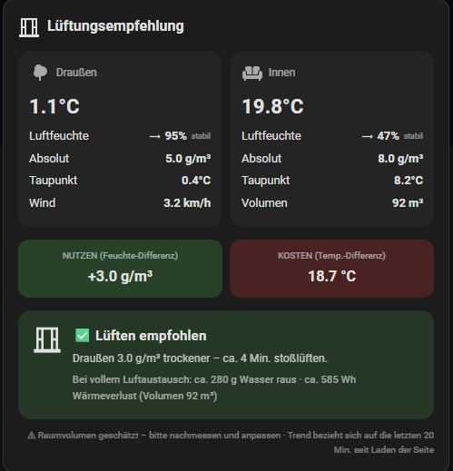

# 🌬️ Blush Lüftungsempfehlung

> ⚠️ **Status: Testphase** – dieses Projekt befindet sich noch in aktiver Entwicklung/Erprobung. Funktionen, Konfiguration und Berechnungen können sich noch ändern.

Eine Custom Lovelace Card für [Home Assistant](https://www.home-assistant.io/), die anhand von Innen- und Außensensoren eine **fundierte Lüftungsempfehlung** gibt — nicht nur "feucht/trocken", sondern eine echte Kosten-Nutzen-Abwägung.

## Warum diese Karte?

Die reine relative Luftfeuchtigkeit (%) ist beim Lüften irreführend, weil sie stark von der Temperatur abhängt: kalte Luft mit 94 % rF trägt trotzdem viel weniger Wasser als warme Luft mit 47 % rF. Diese Karte rechnet stattdessen mit der **absoluten Luftfeuchtigkeit** (g/m³) und dem **Taupunkt** — den physikalisch korrekten Größen — und wägt zusätzlich den **Wärmeverlust** gegen den **Feuchtigkeitsnutzen** ab.

## Features

- ✅ / 👍 / ❌ / ➖ / ⚖️ — klare Empfehlungs-Zustände statt nur Ja/Nein
- **Ziel-Luftfeuchte** einstellbar: liegt der Raum schon darunter, heißt es "👍 Kein Lüftbedarf" statt Dauer-Lüften
- Zeigt, auf welche Feuchte ein voller Luftaustausch den Raum bringen würde (mit Warnung, wenn es zu trocken wird)
- Absolute Luftfeuchtigkeit (g/m³) und Taupunkt, innen und außen
- Wassermenge (g), die bis zum Zielwert raus muss
- Geschätzter Wärmeverlust (Wh) pro Luftaustausch
- Lüftungsdauer (Stack-Effekt-Näherung), durch Wind korrigiert und an den tatsächlichen Bedarf bis zum Zielwert angepasst
- Kosten-Nutzen-Verhältnis (Wh pro Gramm entferntem Wasser) statt starrer Schwellenwerte
- **Optional Fensterkontakt(e)**:
  - Fenster offen → Countdown "Lüften läuft – noch ca. X Min.", dann "⏰ Jetzt Fenster schließen" und "⚠️ Fenster zu lange offen"
  - "✅ Ziel erreicht – Fenster schließen", sobald die Zielfeuchte erreicht ist
  - Warnung, wenn das Fenster offen ist, obwohl draußen die Luft feuchter ist
  - Nach dem Schließen: "Zuletzt gelüftet vor X (Y lang)" aus dem HA-Verlauf
  - Einstellbare Nachlaufzeit ("🕒 Gerade gelüftet"), weil die Feuchte nach dem Lüften kurz wieder ansteigt
- Unabhängige Schimmel-Warnung (Richtwert 60 %/70 % relative Raumluftfeuchte)
- Live-Trendpfeil für die Luftfeuchtigkeit (steigend/fallend/stabil, letzte 20 Min.)
- Vollständiger visueller GUI-Editor (kein YAML nötig)
- Fast jeder Baustein einzeln ein-/ausschaltbar, um die Karte schlanker zu machen
- Mehrere Karten für mehrere Räume möglich (mit eigenem Raumnamen im Titel)

## Screenshot



## Installation

### Über HACS (empfohlen, sobald als Custom Repository hinzugefügt)

1. HACS → Frontend →⋮ → Benutzerdefinierte Repositories
2. Dieses Repository als Typ "Dashboard" hinzufügen
3. "Blush Lüftungsempfehlung" installieren
4. Home Assistant neu laden (Strg+Shift+R im Browser reicht meist)

### Manuell

1. `blush-lueftung-card.js` nach `/config/www/` kopieren
2. Einstellungen → Dashboards → Ressourcen → Ressource hinzufügen
   - URL: `/local/blush-lueftung-card.js`
   - Typ: JavaScript-Modul
3. Seite neu laden

## Verwendung

Karte hinzufügen → "Blush Lüftungsempfehlung" suchen → im visuellen Editor die vier Pflicht-Sensoren auswählen:

| Feld | Pflicht | Beschreibung |
|---|---|---|
| Raumname | Nein | Wird im Kartentitel angezeigt, nützlich bei mehreren Karten |
| Außentemperatur-Sensor | **Ja** | `sensor.*` mit `device_class: temperature` |
| Außen-Luftfeuchte-Sensor | **Ja** | `sensor.*` mit `device_class: humidity` |
| Innentemperatur-Sensor | **Ja** | `sensor.*` mit `device_class: temperature` |
| Innen-Luftfeuchte-Sensor | **Ja** | `sensor.*` mit `device_class: humidity` |
| Windgeschwindigkeit-Sensor | Nein | Beeinflusst die Dauer-Schätzung; leer = keine Windkorrektur |
| Fensterkontakt(e) | Nein | `binary_sensor.*` (on = offen), mehrere möglich. Leer = Karte funktioniert ohne Fensterlogik |
| Nachlaufzeit (Min.) | Nein | Standard: 30. Nach dem Schließen so lange keine neue Lüftempfehlung (nur mit Fensterkontakt) |
| Raumvolumen (m³) | Nein | Standard: 50 m³. Für genaue Wassermengen-/Wärmeverlust-Schätzung wichtig |
| Volumen ist nur geschätzt | Nein | Zeigt einen dezenten Hinweis in der Karte |
| Ziel-Luftfeuchte (%) | Nein | Standard: 55 %. Erst darüber wird Lüften wegen Feuchte empfohlen |
| Untergrenze (%) | Nein | Standard: 40 %. Warnung, wenn Lüften den Raum darunter bringen würde |
| 7 Anzeige-Schalter | Nein | Kästen, Nutzen/Kosten-Kacheln, Taupunkt, Wind, Trend, Wärmeverlust, Schimmel-Warnung einzeln ein-/ausschaltbar |

### Beispiel-YAML

```yaml
type: custom:blush-lueftung-card
name: Wohnzimmer
temp_out: sensor.aussen_temperatur
hum_out: sensor.aussen_luftfeuchtigkeit
temp_in: sensor.wohnzimmer_temperatur
hum_in: sensor.wohnzimmer_luftfeuchtigkeit
wind: sensor.aussen_windgeschwindigkeit
window:
  - binary_sensor.wohnzimmer_fenster
cooldown_minutes: 30
room_volume_m3: 92
room_volume_is_estimate: true
target_humidity: 55
min_humidity: 40
show_columns: true
show_balance: true
show_dewpoint: true
show_wind: true
show_trend: true
show_heat_loss: true
show_mold_warning: true
```

## Wie die Empfehlung berechnet wird

1. **Absolute Luftfeuchtigkeit** (g/m³) wird aus Temperatur + relativer Feuchte berechnet (Magnus-Formel)
2. Die Prüfung läuft in dieser Reihenfolge:
   1. Außenluft absolut feuchter (Differenz ≤ −0,5 g/m³) → ❌ Nicht lüften
   2. Innen-rF ≤ Ziel-Luftfeuchte → 👍 Kein Lüftbedarf
   3. Kaum Unterschied (−0,5 … +0,5 g/m³) → ➖ Lüften bringt kaum etwas
   4. **Kosten-Nutzen-Verhältnis**: anteiliger Wärmeverlust (Wh, über die volumetrische Wärmekapazität von Luft ≈ 0,34 Wh/(m³·K)) geteilt durch die Wassermenge bis zum Zielwert (g). Über 4 Wh/g → ⚖️ Abwägen
   5. Sonst → ✅ Lüften empfohlen
3. **Lüftungsdauer**: `18 / √ΔT` Minuten, durch Wind verkürzt und mit dem Anteil skaliert, der bis zum Zielwert nötig ist (3–25 Min.)
4. **Mit Fensterkontakt**: Beim Öffnen wird die empfohlene Dauer festgehalten, danach laufen Countdown, "Jetzt schließen" (bis ca. doppelte Dauer) und "zu lange offen". Bei weniger als 5 °C Temperaturunterschied gibt es keine Schließ-Aufforderung, weil offen lassen dann kaum Heizenergie kostet.

## Bekannte Grenzen

- **Kein Sensor-Frische-Check**: Ein eingefrorener Sensor (z. B. leere Batterie) würde unbemerkt mit einem alten Wert weiterrechnen. Ließe sich über `last_changed`/`last_updated` ergänzen — bewusst noch nicht eingebaut.
- Die Lüftungsdauer- und Wärmeverlust-Formeln sind **plausible Näherungen**, keine Laborwerte. Echte Luftaustauschraten hängen zusätzlich von Fenstergröße, Öffnungsart (Kipp vs. ganz offen) und Windrichtung relativ zum Fenster ab — Werte, die ohne entsprechende Sensoren nicht erfassbar sind.
- Ein Fensterkontakt unterscheidet nicht zwischen **gekippt** und **ganz offen**. Die Dauer-Empfehlung geht von Stoßlüften aus.
- Die Nachlaufzeit ist ein fester Wert und hängt nicht vom tatsächlichen Wiederanstieg der Feuchte ab.
- Die Schimmel-Warnung prüft nur den **aktuellen** Wert, nicht ob eine erhöhte Feuchte schon länger anhält.

## Lizenz

MIT — siehe [LICENSE](LICENSE)
